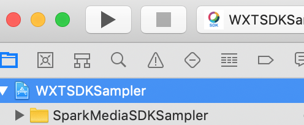
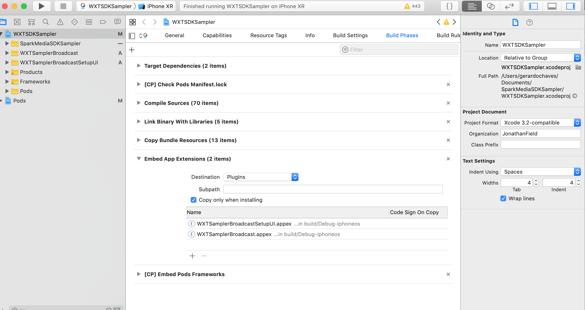
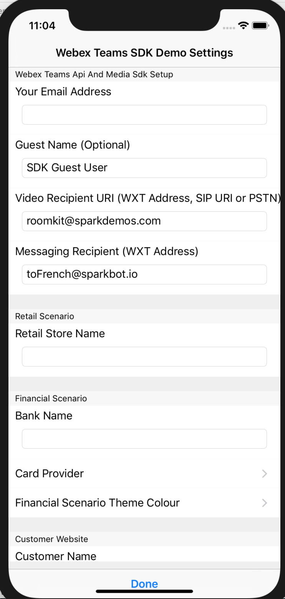

# WEBEX TEAMS SDK VERTICAL SAMPLER

Sample code using swift 3 and xcode to showcase different uses cases from Industries : Retail, Health case

---

## Project short description and introduction.

With this sampler code you can extend the uses of webex teams in different use cases than the tradicional collaboration tools and it is probe that with a SDK you can enhanced the user experience beyon the tradicional webex teams UI 

## Features

* Use a simulator to show with a mobile app messaging and one click video calling from webex teams 

## Solution Components

Code is written in swift 3 and interact with webex teams accounts 

### Cisco Products / Services

* Webex teams

## Usage

This is demo used by xcode swift simulator where you can show how the use of a SDK can created a different front end customized for the end user according to a use case and industry and have as back end webex teams. 

this demo leverage the use of webex teams in different ways 

## Prerequisites

Building iOS Apps requires a number of prerequisites in order to work correctly. In this case please ensure that your system meets the following requirements.

A Mac running the latest version of Mac OS X 10.14 Mojave

If you are unfamiliar with updating Mac OS X you can follow the instructions here Update the software on your Mac - Apple Support
The latest version of XCode downloaded and installed via the Mac App Store (at time of writing 10.1 or greater)
Cocoapods installed and initial pod setup completed (to do this, open your terminal and run the following commands):

sudo gem install cocoapods
pod setup (can take 10-15 minutes sometimes)

In the Terminal which is currently in the WXTKitDemo directory run the pod install command to install dependencies.

pod install

## Demo presenter set up

When you build the code, you can select the iphone model you want to use, please choose the one you know better

When the simulator starts, look for the app calls WXTSDKSamplerr and open it 

When you have the main page click on the screw button to open a windown to configurate the initial parameters of the demo. Be aware to have a Webex teams account and a SIP user@domain.com account to be called. 

Go back to the Home screen (the page that lists all the vertical demos) and press on the Settings Cog in the bottom right of the view.
This is the Settings menu, you can customise various components of the App from here, but in this example, find the ‘Recipient’ field, change the address in that box to your webex teams account email address e.g. xyz@cisco.com or any SIP URI using sip:xyz@abc.com. When you have finished press ‘Done’

Now re-run the demo and you will see that instead of calling a Traffic camera you will call the webex teams Account or SIP URI that you just entered in Settings. You can change this address as often as you would like.

## Installation

Once you clone the repo or download it you need t have xcode v10.1 installed in your laptop 

You need to use xCode 10.1 since the source code is in Swift 3
(download from https://developer.apple.com/download/more/)
https://download.developer.apple.com/Developer_Tools/Xcode_10.1/Xcode_10.1.xip 
You need to log into apple as a developer. Instructions are simple to follow if your AppleID is not a developer account yet. 
- Extract the XCode executable from the .xip file by opening the .xip archive. 
- If you already have a newer version of XCode, then copy the xCode file from the archive into a different folder than Applications so you do not overwrite the newer xCode. Filenames are the same so you have to extract the file info to verify the version number.

- Launch Xcode 10.1
- Open WXTSDKSampler.xcworkspace
- Select Product->Clean Build Folder  from the menu
- Hit the Play button in the upper left of the workspace:

- iF you get this error: Failed to set plugin placeholders for com.cisco.op2 Please do the following 

- On the file explorer in XCode, on the WXTSDKSampler top level, click on it. Then on the tabs on the main window select Build Phases. Then on Embed App Extensions expand it and select "Copy only when installing"

- Hit the Run button again. 

- Simulator should now show the App: 

Click on the cogwheel: 

Enter at least the following:
Your Email Address 
Video Recipient URI (destination of video calls from the Sampler App; ie a cloud registered room system where you will pretent to be a remote expert)
Messaging Recipient (anyones Webex teams account to receive chats)

You are ready to go!

- Sometimes, after a video call, the App becomes unresponsive. If this happens, swipe up from the bottom (if using the iPhone XR simulator) and then swipe away to close the app and re-launch it from the main screen of the simulator

## Documentation

This code is taken from the original repo https://github.com/jfield44/SparkSDKSamplerInstructions  and take some instructions from these other examples : https://github.com/jfield44

